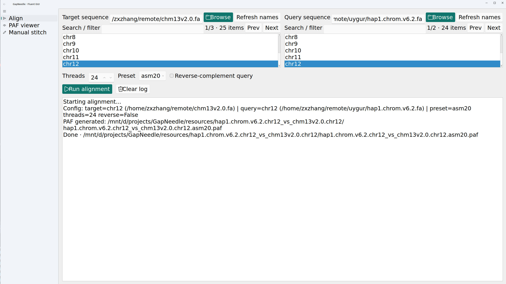
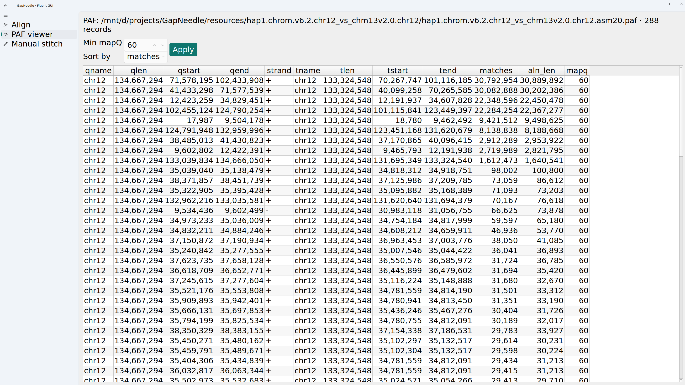
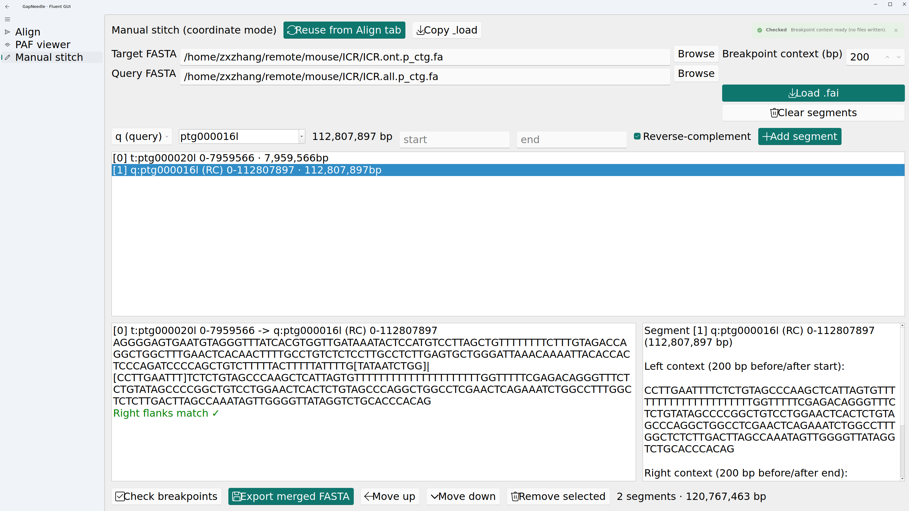

GapNeedle
=========

English README · [中文文档](README_cn.md)

Lightweight gap-filling helper that wraps minimap2 (mappy) for single-sequence alignment, PAF parsing, and fast stitching. Ships a GUI and Python API focused on efficient align → inspect → stitch workflows.

Contents
--------
- Quickstart
- Installation
- GUI Guide
  - Alignment
  - Alignment Viewer
  - Stitching
- Reverse-Complement Notes
- Python API Example
- Config & Outputs
- FAQ

Quickstart
----------
```bash
# One-shot install with GUI dependencies
pip install ".[gui]"

# Launch GUI
python -m gapneedle.gui.app
```
Use the GUI for alignment, inspection, and stitching; or call the Python API directly.

Installation
------------
- Python 3.9+
- Core: `mappy` (installed with `pip install ".[gui]"`)
- GUI: `PyQt5`, `PyQt-Fluent-Widgets` (installed with the `gui` extra)
Core-only: `pip install .`  
Dev mode: `pip install -e ".[gui]"`.

GUI Guide
---------
Two tabs: Alignment and Manual Stitch; a log panel streams progress; long sequence lists support paged search.

### Alignment
- Input: target FASTA, query FASTA, their sequence names; optional threads, preset, reverse-complement query.
- Output: PAF at `{query}.{qseq}_vs_{target}.{tseq}/{...}.paf` under `resources/` (configurable).



Steps:
1) Click Browse to pick target/query FASTA, then select sequence names.  
2) Set threads (default 4), preset (default asm20; also asm5/asm10/map-ont/...), and optionally reverse-complement query.  
3) Run alignment. The log shows the PAF path and caches selections for stitching.

### Alignment Viewer
- After alignment, click the PAF path in the log to view records, or load a PAF manually.
- Shows: query/target lengths & coords, strand (-> or <-), matches, alignment length, mapq.



### Stitching
- Input: PAF plus target/query FASTA and names; can reuse Alignment tab context.
- Flow:
  1) Switch to Manual Stitch, click “Fill from Align tab”.
  2) Choose a PAF; candidates are listed by overlap length.
  3) Pick a candidate; preview breakpoint context (default 200bp each side), green = match, orange = mismatch.
  4) Export FASTA (default `<target>+<query>`) and a `.md` log with segment provenance and breakpoints.



Reverse-Complement Notes
------------------------
- Why: use when the query orientation is unknown or expected to be on the opposite strand, ensuring correct alignment and stitching direction.
- How: check “Reverse-complement query” on the Alignment tab before running. Only the query supports reverse-complement; the target is not supported.
- Coordinates: when enabled, the PAF coordinates are based on the reverse-complemented query; the Stitch tab uses the same orientation so stitch/breakpoint coordinates stay consistent with Alignment.
- Caution: leaving it unchecked for a reversed query can yield weak/failed alignments; checking it unnecessarily means coordinates correspond to the RC strand—confirm before stitching.

Python API Example
------------------
```python
from gapneedle import GapNeedle

gf = GapNeedle()
run = gf.align("ref.fa", "qry.fa", "chr1", "chr1", threads=8, preset="asm10")
print("PAF:", run.output_path)

merged_path = gf.stitch(run=run, selection=None, interactive=False)  # auto-pick first candidate
print("Merged FASTA:", merged_path)
```

Config & Outputs
----------------
- Config: project-root `configuration.py` (or package defaults). Set fonts, window size, default open/save dirs, PAF output dir, etc.
- Naming:
  - PAF: `{query}.{qseq}_vs_{target}.{tseq}.{preset}.paf` under `resources/` or the configured dir.
  - Stitch result: `<paf>.stitched.fasta` (seq name `<target>+<query>`) or GUI-selected path.
  - Stitch log: `.md` with the same prefix as the output FASTA.

FAQ
---
- **Cannot import mappy**: install `pip install mappy` (or `conda install -c bioconda mappy`); ensure minimap2 libs are available.
- **GUI tweaks not applied**: edit `configuration.py`, then restart the GUI.
- **PAF missing**: check sequence names; if reuse is on and the PAF exists, the run is skipped (“Existing PAF detected”).
